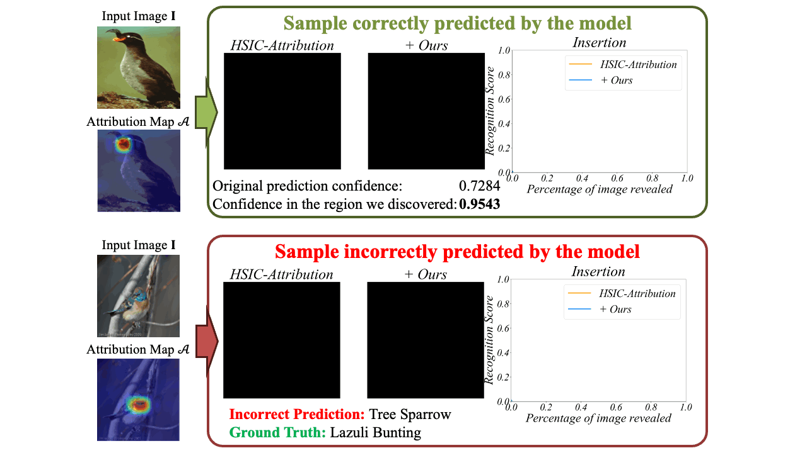
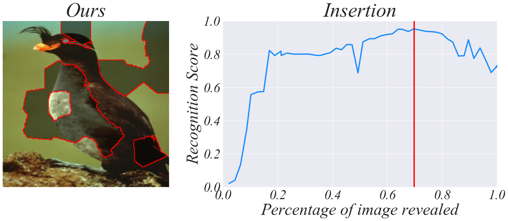
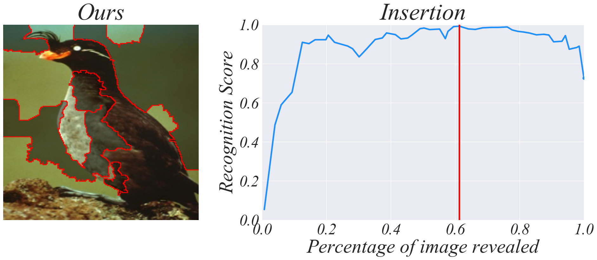
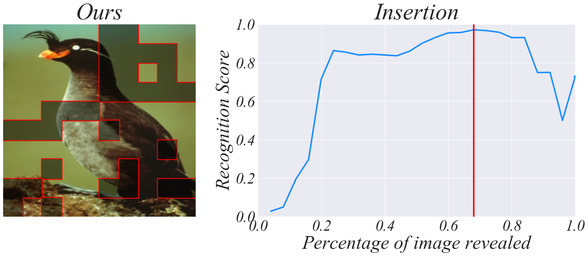
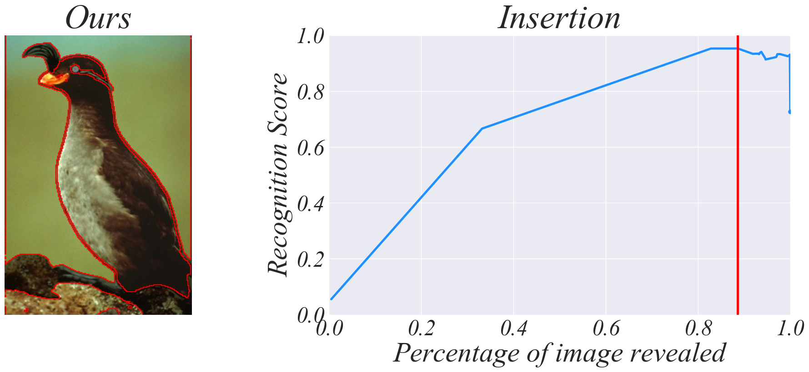
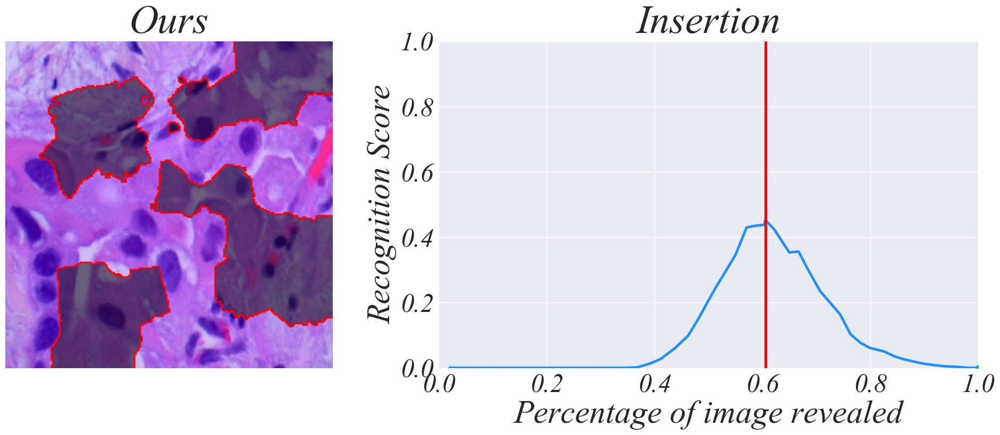

<h2 align="center"> <a href="https://openreview.net/forum?id=jKTUlxo5zy">【ICLR 2024 Oral 🔥】Less is More: Fewer Interpretable Region via Submodular Subset Selection</a></h2>
<h5 align="center"> If you like our project, please give us a star ⭐ on GitHub for latest update.  </h2>

[](https://arxiv.org/abs/2402.09164)
[](https://huggingface.co/spaces/RuoyuChen/SMDL-Attribution)


[](https://paperswithcode.com/sota/image-attribution-on-celeba?p=less-is-more-fewer-interpretable-region-via)

[](https://paperswithcode.com/sota/error-understanding-on-cub-200-2011-1?p=less-is-more-fewer-interpretable-region-via)

	
[](https://paperswithcode.com/sota/image-attribution-on-cub-200-2011-1?p=less-is-more-fewer-interpretable-region-via)

	
[](https://paperswithcode.com/sota/image-attribution-on-vggface2?p=less-is-more-fewer-interpretable-region-via)




## 📰 News & Update

- **[2024.08.22]** Our approach now supports audio attribtuon on foundation model, we use ImageBind as an example! Welcome to try it according to the [tutorial](./tutorial/tutorial-vggsound_attribution.ipynb)!
- **[2024.06.16]** Our approach now supports medical multimodal model [Quilt](https://github.com/wisdomikezogwo/quilt1m/) interpretation! Welcome to try it according to the [tutorial](./tutorial/tutorial-submodular-quilt.ipynb)!
- **[2024.06.04]** Our approach now supports `multi-gpus` interpretation proccessing, please refer to the [./scripts](./scripts) fold!
- **[2024.06.04]** Our approach now supports [CLIP](https://github.com/openai/CLIP) interpretation! Welcome to try it according to the [tutorial](./tutorial/tutorial-submodular-clip-vitl.ipynb)!
- **[2024.04.22]** Our approach now supports [LanguageBind](https://github.com/PKU-YuanGroup/LanguageBind) interpretation! Welcome to try it according to the [tutorial](./tutorial/tutorial-submodular-languagebind.ipynb)!
- **[2024.04.11]** Our approach now supports multi-modal models with ViT as backbone ([ImageBind](https://github.com/facebookresearch/ImageBind), Pytorch only)! Welcome to try it according to the [tutorial](./tutorial/tutorial-submodular-imagebind.ipynb)!
- **[2024.01.17]** The original code is available now! Welcome to try it according to the [tutorial](./tutorial/tutorial-submodular-cub.ipynb)!
- **[2024.01.16]** The paper has been accepted by ICLR 2024 and selected for oral presentation!

## 🛠️ Environment (Updating)

Our method will both support `keras` and `pytorch` two deep learning frameworks. You can first install `pytorch`.

```python
opencv-python
opencv-contrib-python
mtutils
tqdm
scipy
scikit-learn
scikit-image
matplotlib==3.7.1
seaborn==3.7.1
xplique>=1.0.3
```

Our original code is based on `Keras`, and the method of verification on the ViT model will be completely dependent on `Pytorch`.

```
conda create -n smdl python=3.10
conda activate smdl
python3 -m pip install tensorflow[and-cuda]

pip install git+https://github.com/facebookresearch/segment-anything.git
```

## 🐳 Model Zoo

**Note: Our method will no more support TensorFlow/Keras, but focus on PyTorch.**

Recognition Models (Please download and put the models to the path `ckpt/keras_model`):

| Datasets | Model |
| -|-|
| Celeb-A | [keras-ArcFace-R100-Celeb-A.h5](https://huggingface.co/RuoyuChen/SMDL-Attribution/resolve/main/keras_model/keras-ArcFace-R100-Celeb-A.h5?download=true) |
| VGG-Face2  | [keras-ArcFace-R100-VGGFace2.h5](https://huggingface.co/RuoyuChen/SMDL-Attribution/blob/main/keras_model/keras-ArcFace-R100-VGGFace2.h5)  |
| CUB-200-2011 | [cub-resnet101.h5](https://huggingface.co/RuoyuChen/SMDL-Attribution/resolve/main/keras_model/cub-resnet101.h5?download=true), [cub-resnet101-new.h5](https://huggingface.co/RuoyuChen/SMDL-Attribution/resolve/main/keras_model/cub-resnet101-new.h5?download=true), [cub-efficientnetv2m.h5](https://huggingface.co/RuoyuChen/SMDL-Attribution/resolve/main/keras_model/cub-efficientnetv2m.h5?download=true), [cub-mobilenetv2.h5](https://huggingface.co/RuoyuChen/SMDL-Attribution/resolve/main/keras_model/cub-mobilenetv2.h5?download=true), [cub-vgg19.h5](https://huggingface.co/RuoyuChen/SMDL-Attribution/resolve/main/keras_model/cub-vgg19.h5?download=true)|

Uncertainty Estimation Models (Please download and put the models to the path `ckpt/pytorch_model`):

| Datasets | Model |
| -|-|
|Celeb-A| [edl-101-10177.pth](https://huggingface.co/RuoyuChen/SMDL-Attribution/resolve/main/pytorch_model/edl-101-10177.pth?download=true) |
| VGG-Face2 | [edl-101-8631.pth](https://huggingface.co/RuoyuChen/SMDL-Attribution/resolve/main/pytorch_model/edl-101-8631.pth?download=true) |
| CUB-200-2011 | [cub-resnet101-edl.pth](https://huggingface.co/RuoyuChen/SMDL-Attribution/resolve/main/pytorch_model/cub-resnet101-edl.pth?download=true) |

## 😮 Highlights

|Sub-Region Division Method| Attribution Visualization | Org. Prediction Score | Highest Prediction Score | Insertion AUC Score | 
|:--:|:--:|:--:|:--:|:--:|
| SLICO |  | 0.7262 | 0.9522 | 0.7604 |
| SEEDS |  | 0.7262 | 0.9918 | 0.8862 |
| Prior Saliency Map + Patch |  | 0.7262 | 0.9710 | 0.7236 |
| Segment Anything Model |  | 0.7262 | 0.9523 | 0.6803 |

Audio classification (on multimodal foundation model ImageBind) attribution:


Medical multimodal model debugging:



## 🗝️ How to Run (Updating)

If you want to see how to apply this to your own model, please refer to the jupyter notebooks in [./tutorial/](./tutorial/) first.

Note: We first publish how to evaluate attribution for multimodal models and how to evaluate it.

Multi GPUs, please refer to the [./scripts](./scripts) fold, for example:

```shell
./scripts/clip_multigpu.sh
```

Then, you may get a saved intermediate result in the path `submodular_results/imagenet-clip-vitl/slico-0.0-0.05-1.0-1.0`.

Evaluate the Insertion and Deletion metrics:

```shell
python -m evals.eval_AUC_faithfulness --explanation-dir submodular_results/imagenet-clip-vitl/slico-0.0-0.05-1.0-1.0
```

you may get the results:

```
Insertion AUC Score: 0.7550
Deletion AUC Score: 0.0814
```

<!-- ### 1. Generate prior saliency map -->


<!-- First, the priori saliency maps for sub-region division needs to be generated.

```
CUDA_VISIBLE_DEVICES=0 python generate_explanation_maps.py
```

Don't forget to open this file and revise the variable `mode` and `net_mode`:

- `mode`: ["Celeb-A", "VGGFace2", "CUB", "CUB-FAIR"]

- `net_mode`: ["resnet", "efficientnet", "vgg19", "mobilenetv2"], note that these net_mode only for `mode` is CUB-FAIR.


### 2. Compute attribution

```
CUDA_VISIBLE_DEVICES=0 python smdl_explanation.py
``` -->

## 👍 Acknowledgement

[Xplique](https://deel-ai.github.io/xplique/latest/): a Neural Networks Explainability Toolbox

[Score-CAM](https://github.com/tabayashi0117/Score-CAM/): a third-party implementation with Keras.

[Segment-Anything](https://github.com/facebookresearch/segment-anything): a new AI model from Meta AI that can "cut out" any object, in any image, with a single click.

[CLIP](https://github.com/openai/CLIP): a neural network trained on a variety of (image, text) pairs. It can be instructed in natural language to predict the most relevant text snippet, given an image, without directly optimizing for the task

[ImageBind](https://github.com/facebookresearch/ImageBind): ImageBind learns a joint embedding across six different modalities - images, text, audio, depth, thermal, and IMU data. It enables novel emergent applications ‘out-of-the-box’ including cross-modal retrieval, composing modalities with arithmetic, cross-modal detection and generation.

[LanguageBind](https://github.com/PKU-YuanGroup/LanguageBind): LanguageBind is a language-centric multimodal pretraining approach, taking the language as the bind across different modalities because the language modality is well-explored and contains rich semantics.

## ✏️ Citation

```bibtex
@inproceedings{chen2024less,
  title={Less is More: Fewer Interpretable Region via Submodular Subset Selection},
  author={Chen, Ruoyu and Zhang, Hua and Liang, Siyuan and Li, Jingzhi and Cao, Xiaochun},
  booktitle={The Twelfth International Conference on Learning Representations},
  year={2024}
}
```
